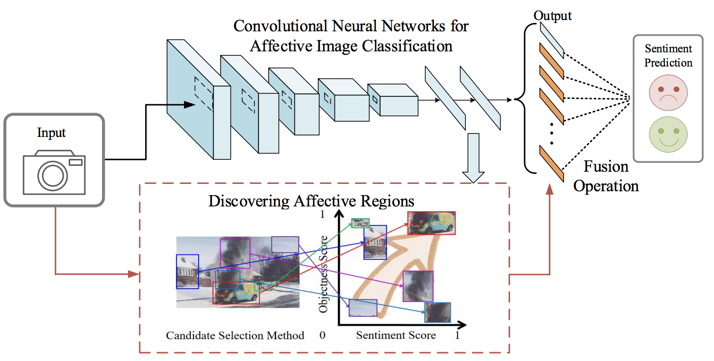

# Visual Sentiment Prediction based on Automatic Discovery of Affective Regions

By Jufeng Yang, Dongyu She, Ming Sun, Ming-Ming Cheng, Paul L. Rosin and Liang Wang

### Introduction

We propose a framework for sentiment classification and affectiv regions discovery with deep ConvNets. 


- It achieves state-of-the-art performance on sentiment classification, and very competitive results on object discovery.
- Our code is written by matlab, based on [Caffe](http://caffe.berkeleyvision.org/).

The paper has been accepted by TMM 2018. For more details, please refer to our [paper](http://cv.nankai.edu.cn/papers/2018tmmvisual.pdf).

### Architecture

<p align="left">

</p>

### License

Our framework is released under the MIT License (refer to the LICENSE file for details).

### Citing

If you find our framework useful in your research, please consider citing:

    @article{tmm2018visual,
    	Author = {Jufeng Yang, Dongyu She, Ming Sun, Ming-Ming Cheng, Paul L. Rosin, Liang Wang},
    	Title = {Visual Sentiment Prediction based on Automatic Discovery of Affective Regions},
    	journal = {TMM},
    	volume = 99,
    	numer = 99,
    	pages = {1-1},
    	Year = {2018}
    }

### Contents

1. [Requirements: software](#requirements-software)
2. [Requirements: hardware](#requirements-hardware)
3. [Basic installation](#installation)
4. [Extra Downloads (objectness)](#download-pre-computed-object-proposals)
5. [Extra Downloads (trainval split)](#download-train-val-split)
7. [Usage](#usage)
8. [Trained models](#our-trained-models)

### Requirements: software

1. Requirements for `Caffe` and `matcaffe` (see: [Caffe installation instructions](http://caffe.berkeleyvision.org/installation.html))

  **Note:** Caffe *must* be built with support for Matlab!

  ```make
  # This is required only if you will compile the matlab interface.
  # MATLAB directory should contain the mex binary in /bin.
  MATLAB_DIR := /usr/local
  ```
2. MATLAB

### Requirements: hardware

1. NVIDIA GTX TITANX (~12G of memory)

### Installation

1. Clone the repository
  ```Shell
  # Make sure to clone with --recursive
  git clone --recursive https://github.com/sherleens/AR_discovery.git
  ```
2. Build Caffe and matcaffe
  ```Shell
  cd $AR_ROOT/caffe
  # Now follow the Caffe installation instructions here
  #   http://caffe.berkeleyvision.org/installation.html
  # If you're experienced with Caffe and have all of the requirements installed
  # and your Makefile.config in place, then simply do:
  make all -j 8 && make matcaffe
  ```

### Download pre-computed object proposals

Pre-computed bounding boxes generated by [Objectness](http://groups.inf.ed.ac.uk/calvin/objectness/), which can also be downloaded [here](https://pan.baidu.com/s/1BjjSDvC0tuJmbmuhssetqQ) (password: kai7) for affective datasets.

### Download dataset config

Train val split can be downloaded [here](https://pan.baidu.com/s/1BjjSDvC0tuJmbmuhssetqQ) (password: kai7) for affective datasets.

### Usage

**Train** a deep network. For example, train a VGG16 network on FI trainval.

```Shell
cd prototxt && bash ./train_vgg_FI.sh
```

**Test** a deep network. For example, test the VGG 16 network on FI test:

```
run demo.m in matlab
```

The final prediction is saved in code/result.txt

### Our trained models

The models trained on the FI dataset can be downloaded from [here](https://pan.baidu.com/s/1BjjSDvC0tuJmbmuhssetqQ) (password: kai7).
<<<<<<< HEAD

=======
>>>>>>> 67f963aaa6ad5c0f2ec83c47960854fd196bdb2f
